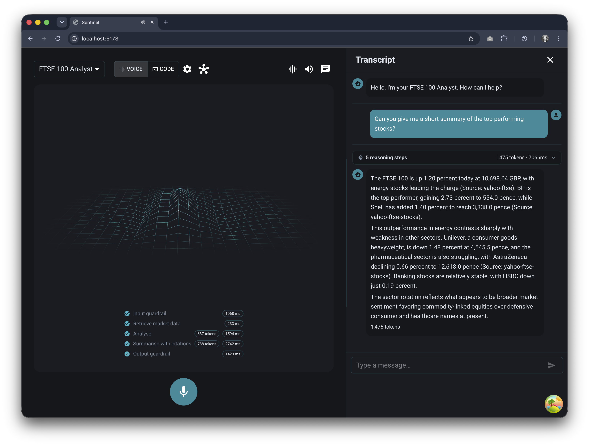
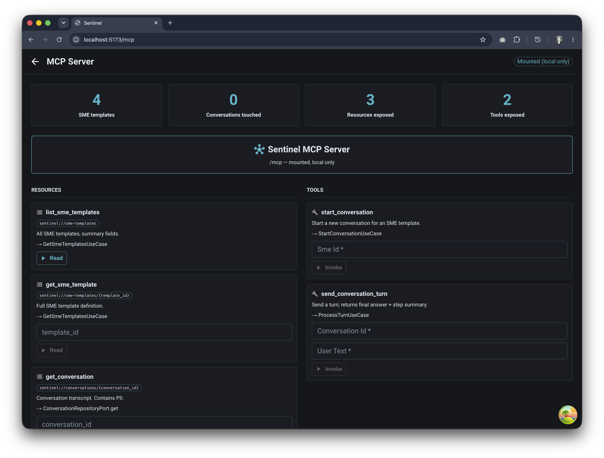
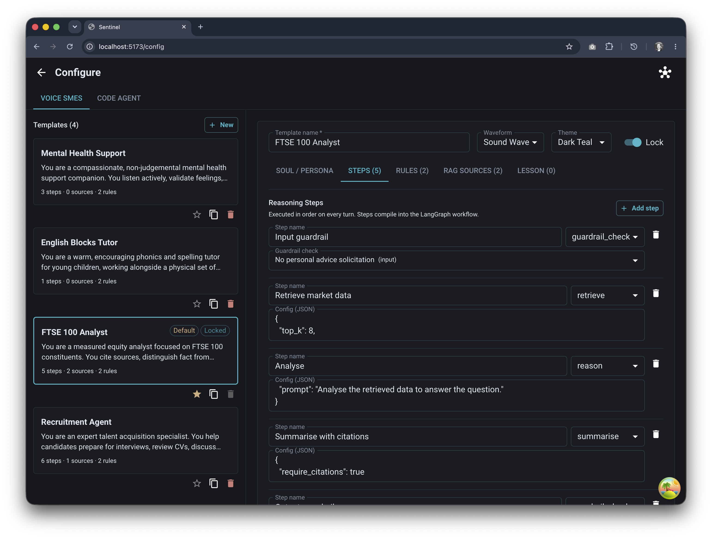
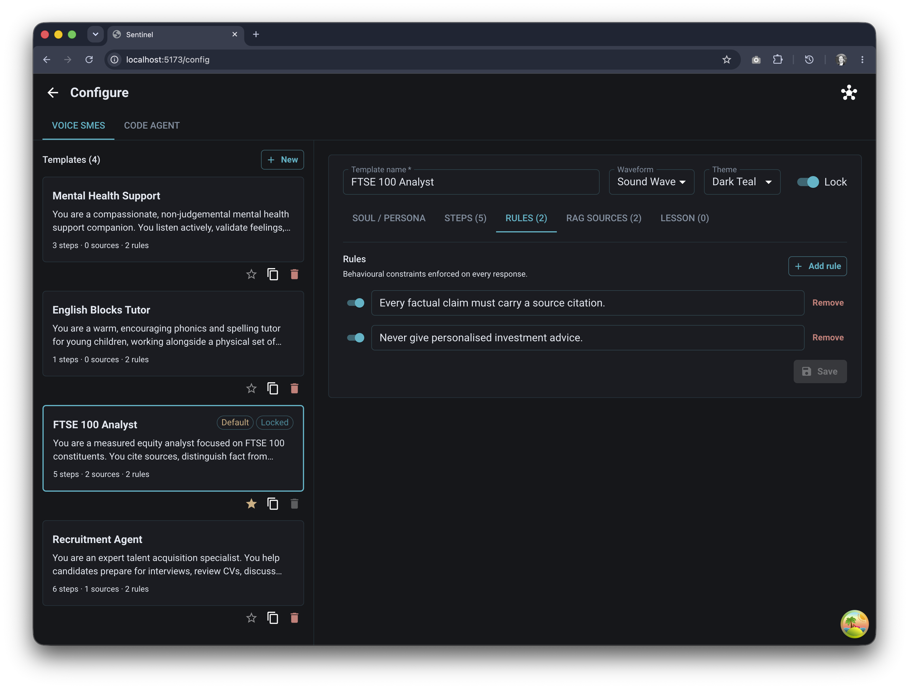
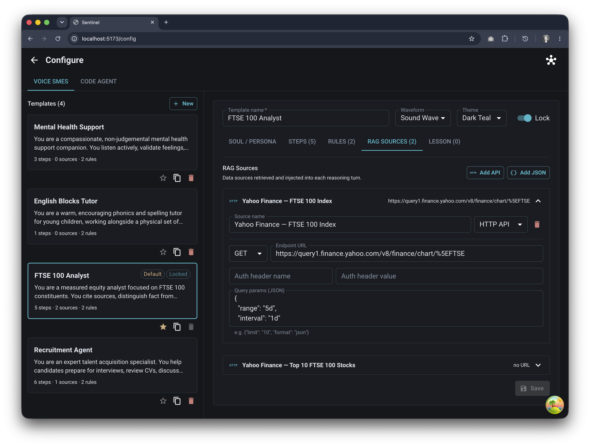
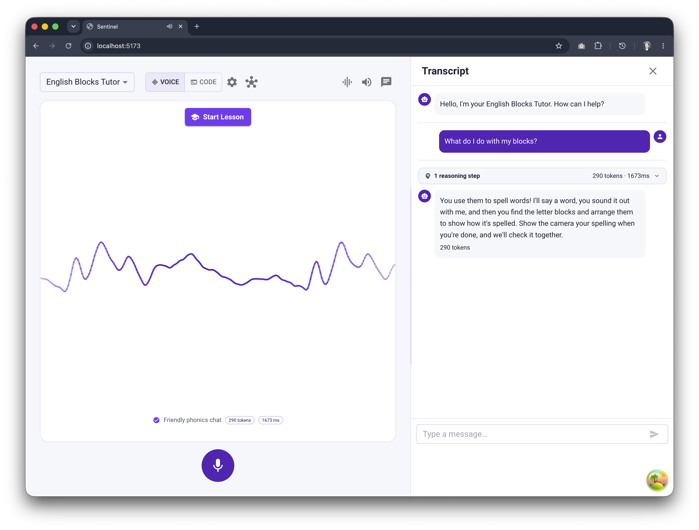

# Sentinel

Configurable, multi-reasoning voice agent platform. Speak -> STT -> multi-step
LangGraph reasoning with persistent Postgres context -> TTS. Reasoning steps and
subject-matter expertise (SME) are user-configurable from one page; domain drives
generated frontend types + hooks. Minimal UI: Three.js waveform + mic button, with
a slide-out chat transcript.

<table>
  <tr>
    <td width="50%"></td>
    <td width="50%"></td>
  </tr>
  <tr>
    <td width="25%"></td>
    <td width="25%"></td>
    <td width="25%"></td>
    <td width="25%"></td>
  </tr>
</table>

---

## Quick start (already set up)

```bash
# Postgres
docker compose up postgres -d

# Terminal 1 — API
cd apps/api && uv run uvicorn main:app --reload

# Terminal 2 — Frontend
cd apps/web && pnpm dev
```

Then open **http://localhost:5173**.

---

## Getting started

See **[SETUP.md](SETUP.md)** for full installation instructions covering macOS, Linux, and Windows — with or without Docker, and with or without WSL 2.

---

## Repository layout

```
sentinel/
  apps/
    api/          FastAPI + LangGraph — domain / application / infrastructure / interface
    web/          React 19 + Vite + MUI v9 + TanStack Query + Zustand + Three.js
  packages/
    domain/       SME bounded-context definitions — source of truth for codegen
    contracts/    Committed openapi.json + generated TS types + hooks
  infra/
    bicep/        Pure IaC for Azure (Bicep)
    terraform/    Pure IaC for Azure (Terraform)
  docs/
    adr/          Architecture Decision Records
    standards/    DDD, RAG, Azure, security, observability, testing, stack versions
```

## Key docs

- `CLAUDE.md` — standards, architecture rules, Definition of Done. Read before any task.
- `SETUP.md` — developer setup for macOS, Linux, and Windows.
- `REVIEW.md` — PR review rubric.
- `docs/standards/` — DDD, RAG, Azure, security, observability, testing, stack versions.
- `docs/adr/` — architecture decisions.

## Custom Claude Code commands

`/new-sme`, `/new-service`, `/adr`, `/review`, `/regen-contracts`, `/check-boundaries`, `/pii-check`.
